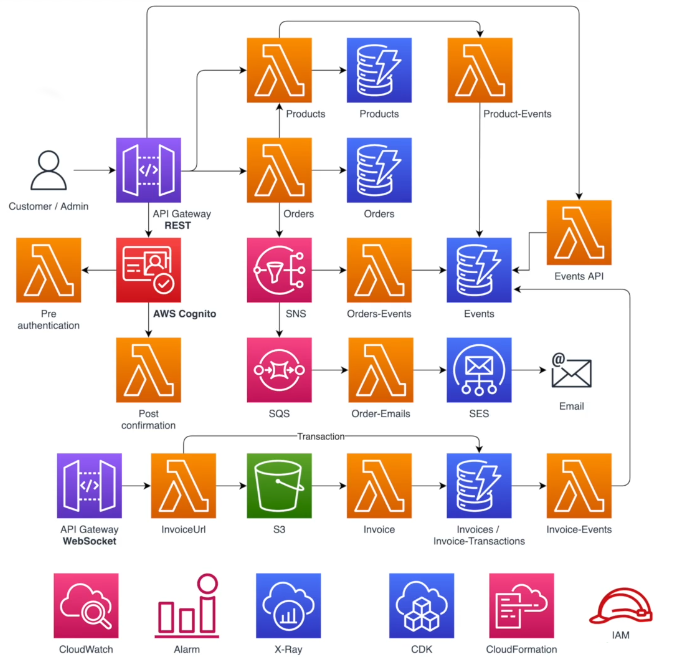

<p align="center">
  
</p>

<div align="center" >

  <h1>Mercúrio E-Commerce</h1>

  <p>This project is being developed as a way to study AWS services. It consists of a fictional eCommerce, which I named Mercurio. In this project, we will use various AWS services, such as Lambda, DynamoDB, SNS, SQS, S3, EventBridge, and API Gateway, all built using CDK.<p>

  <p>The system will include product and order management, event generation, invoice import, auditing, alarms, and user authentication.<p>

  <p>Throughout the project, I will be guided by Professor Paulo Siécola, the founder of <a href="https://siecola.com.br/">Siecola Code</a>, following his <a href="https://www.udemy.com/course/aws-serverless-nodejs-cdk-pt/">course</a> on Udemy.</p>

</div>

<div align="left">
  <h2>Architectural Design</h2>
  

  <h2>Developer</h2>
  <a href="https://www.linkedin.com/in/joao-pr/">João Pedro Ribeiro</a>
</div>

<!-- ## Instalação

Para instalar o projeto siga a seguinte ordem de comandos:

1- Primeiro na pasta raíz

```bash
$ yarn install
```

## Rodando o projeto

Ambos os projetos rodam com o seguinte comando

```bash
$ yarn start
```

Para que o projeto de backend rode localmente é necessario configurar o .env de maneira correta.
Temos os seguintes campos:

```
CDK_DEFAULT_ACCOUNT =
AWS_REGION =
```

### Rotas

Caso queira ver todas as rotas e os campos a serem enviados temos em nosso projeto uma pasta chamada collections, onde está a collection e environments do postman. Basta importa-los no postman e utilizar! -->
